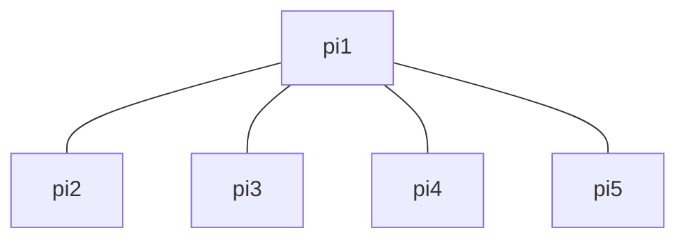
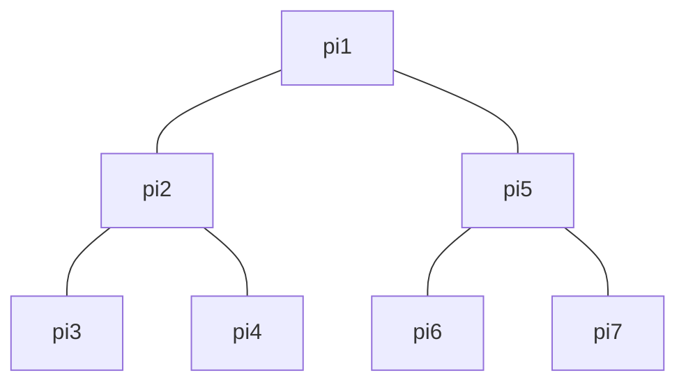

# HCDDL: Hierarchical Clustered Distributed Deep Learning
> A distributed deep learning approach implemented with [Flower](https://flower.ai/) and [TensorFlow](https://tensorflow.org/)

## Getting Started

### 1. Set Up Local Device

First, set up the local device that will coordinate training.

Clone the repo and move into it:

```console
$ git clone https://github.com/dfl0/hcddl.git && cd hcddl
```

Create a Python ($\geq$ 3.11.2) virtual environment:

```console
$ python -m venv venv
```

Install dependencies:

```console
$ venv/bin/pip install -r resources/requirements.txt
```
Finally, make sure [Ansible](https://docs.ansible.com/ansible/latest/installation_guide/intro_installation.html) is also installed on your local machine.

### 2. Define a Device Pool

Next, create an inventory file specifying the pool of devices to participate in the training. Either host aliases or direct IP addresses can be used. For example,

```ini
[pool]
pi1
pi2
pi3
pi4
pi5
pi6
pi7
...
```

Or alternatively,

```ini
[pool]
192.168.2.101
192.168.2.102
192.168.2.103
192.168.2.104
192.168.2.105
192.168.2.106
192.168.2.107
...
```

The name of the inventory file is arbitrary, but it must include a `pool` group and follow a [format supported by Ansible](https://docs.ansible.com/ansible/latest/inventory_guide/intro_inventory.html#inventory-basics-formats-hosts-and-groups).

> [!TIP]
> Use `ansible -m ping -i <inventory-file> all` to verify that all devices are reachable before setup.

### 3. Set Up Devices

Before doing anything, all the devices must be set up with the necessary Python version, dependencies, and files. The following command will take care of everything:

```console
$ ansible-playbook -i <inventory-file> -u <remote-user> playbooks/setup.yml
```

This will do a few things:
1. Ensure the necessary Python version is installed on all the devices
2. Create a new directory `~/hcddl`
3. Create a virtual environment in `~/hcddl` and installs all the necessary packages to it
4. Copy over scripts to start up the training roles on the devices

### 4. Configure Training

You will need to create a `config.yml` file to specify the training parameters and desired architecture with associated options. This supports both flat (single-layer) and hierarchical (two-layer) architectures.

> [!IMPORTANT]
> Make sure your device pool has a sufficient number of devices to support your configuration.

#### Training Options

You can set the number of server rounds, target accuracy, and batch size in `config.yml` as follows:

```yml
---
num_server_rounds: 5
target_accuracy: 0.9
batch_size: 32
...
```

#### Flat Architecture

To use a flat architecture for training, set `arch` to `flat` and specify just a parameter server by giving it a type and number of workers.

For example, a full `config.yml` file could look like this:

```yml
---
num_server_rounds: 5
target_accuracy: 0.9
batch_size: 32

arch: flat
parameter_server:
    aggr_type: sync
    num_workers: 4
```

This configuration would assign the devices in the above inventory file as follows:



Here, `pi1` is the parameter server, and `pi2`, `pi3`, `pi4`, and `pi5` are the workers.

#### Hierarchical Architecture

To use a hierarchical architecture for training, set `arch` to `hierarchical` and specify a global parameter server by giving it a type, as well as its local servers each with their own type and number of workers.

For example, a full `config.yml` file could look like this:

```yml
---
num_server_rounds: 5
target_accuracy: 0.9
batch_size: 32

arch: hierarchical
global_server:
  aggr_type: sync
  local_servers:
    - type: async
      num_workers: 2
    - type: async
      num_workers: 2
```

This configuration would assign the devices in the above inventory file as follows:



Here, `pi1` is the global parameter server, `pi2` and `pi5` are the local parameter servers, and `pi3`, `pi4`, `pi6`, and `pi7`, are the workers.

### 5. Run Training

Now that everything is set up, the training can be deployed and started with the following command:

```console
$ ansible-playbook -i <inventory-file> -u <remote-user> playbooks/run.yml
```

## Monitoring Training

Once the training begins, logs are written to `~/hcddl/run.log` on all of the devices. To see the live output on any single device, the log file can be viewed on the device itself as it is updated with the following command:

```console
$ tail -f ~/hcddl/run.log
```

Alternatively, this can be done from the local machine directly with the
following command:

```console
$ ssh <remote-user>@<remote-host> "tail -f ~/hcddl/run.log"
```

## Maintenance and Cleanup

If any Flower processes remain active on the remote devices on the remote devices (e.g., if the local machine goes down), they can be terminated from the local machine by running the following command:

```console
$ ansible -m shell -a "pgrep flower | xargs kill" all
```

This takes care of all remote devices specified in the inventory file.
